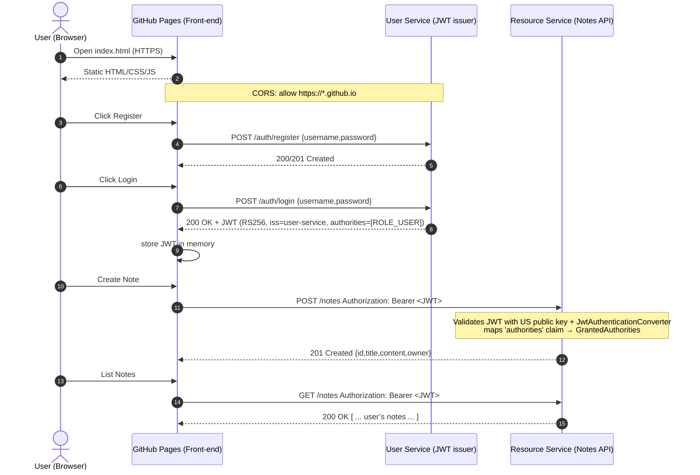

# Secure Microservices - Diplomski rad

---
Систем се састоји од фронтенд апликације (GitHub Pages) и два микросервиса (User Service и Resource Service) хостованих на Render-у. Безбедносни аспекти:

- **CORS origins:** у оба сервиса подешен је `allowedOriginPatterns` да дозвољава захтеве са:
    - `https://*.github.io` (GitHub Pages)
    - `https://*.onrender.com` (Render)
    - `http://localhost:*` (локални развој)  
      Ово омогућава да статичка страница шаље HTTPS/HTTP позиве према API сервисима.

- **JWT claims:** приликом логовања User Service издаје JWT са кључним пољима:
    - `iss` (issuer = `user-service`)
    - `authorities` (нпр. `ROLE_USER`) за RBAC у Resource Service

- **Resource Service validation pipeline:**  
  `JwtDecoder` (RSA public key signature verify) → `JwtAuthenticationConverter` (map `authorities` → `GrantedAuthority`) → URL/методска ауторизација.

- **Password hashing:** лозинке корисника се **не чувају у чистом тексту**, већ као хешеви уз **`BCryptPasswordEncoder`**. При регистрацији користи се `passwordEncoder.encode(rawPassword)`, а при логину `passwordEncoder.matches(raw, storedHash)`. 

- **Security boundaries:**  
  HTTPS свуда; приватни/јавни кључеви су искључиво на серверској страни (Docker/Render Secret Files) и **нису** доступни клијенту.

---
## Структура репозиторијума

```
secure-microservices/
├── user-service/          # Spring Boot сервис за регистрацију, логовање и издавање JWT
├── resource-service/      # Spring Boot сервис за рад са белешкама, верификује JWT
├── jwt-keys/              # RSA приватни и јавни кључеви (за демонстрацију)
└── docs/                  # GitHub Pages фронтенд (index.html)
```
---
## Архитектура



